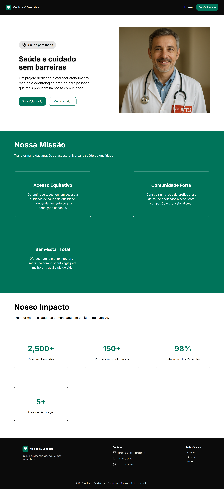

# 🩺 Médicos & Dentistas

Aplicação web institucional desenvolvida com **React + Vite**, focada em **componentização, organização de código e responsividade**, simulando um projeto real voltado para impacto social na área da saúde.

---

## 🚀 Demonstração

### 🏠 Home


### 🤝 Página de Voluntariado


---

## 🛠️ Tecnologias Utilizadas

- React.js
- Vite
- JavaScript (ES6+)
- SCSS Modules
- React Router DOM

---

## 📂 Estrutura do Projeto

```bash
src/
│
├── assets/
│   ├── Screenshots/
│   └── imagens gerais
│
├── components/
│   ├── Header/
│   ├── Footer/
│   ├── ui/
│   └── sections/
│
├── pages/
│   ├── Home/
│   └── Voluntario/
│
├── styles/
│   ├── global.scss
│   ├── variables.scss
│   └── mixins.scss
```

---

## ✨ Funcionalidades

- Página institucional responsiva  
- Página dedicada para voluntariado  
- Formulário com validação básica  
- Componentes reutilizáveis (Cards, Layout, UI)  
- Organização escalável de estilos com SCSS Modules  
- Sistema de variáveis e mixins (design system básico)  

---

## 🎯 Diferenciais Técnicos

- 📦 Separação clara entre **UI, Sections e Pages**  
- 🎨 Uso de **SCSS Modules** para isolamento de estilos  
- 🧩 Componentização reutilizável (ex: `InfoCard`)  
- 🧠 Uso de **variables.scss + mixins.scss** para padronização  
- 📱 Responsividade para mobile, tablet e desktop  
- 🧱 Estrutura pensada para crescimento do projeto  

---

## 📚 Aprendizados

Este projeto foi essencial para consolidar:

- Organização de projetos React  
- Arquitetura de componentes  
- Reutilização de estilos com SCSS  
- Responsividade na prática  
- Separação de responsabilidades (UI vs lógica)  

---

## 📦 Como rodar o projeto

```bash
# Clone o repositório
git clone https://github.com/Hossomii/medicos-dentistas-vnw.git

# Acesse a pasta
cd medicos-dentistas-vnw

# Instale as dependências
npm install

# Rode o projeto
npm run dev
```

---

## 🌐 Deploy

```
https://medicos-e-dentistas-zeta.vercel.app/
```

---

## 👨‍💻 Autor

**Anthony Hossomi**

- 💼 Focado em Desenvolvimento Frontend  
- 🎯 Em evolução para projetos reais e oportunidades profissionais  
- 🚀 Interesse em interfaces interativas e experiências gamificadas  

---

## 📌 Status do Projeto

✅ Finalizado (versão inicial)  
🔄 Possível evolução futura com:  
- Backend integrado  
- Sistema real de cadastro  
- Dashboard administrativo  